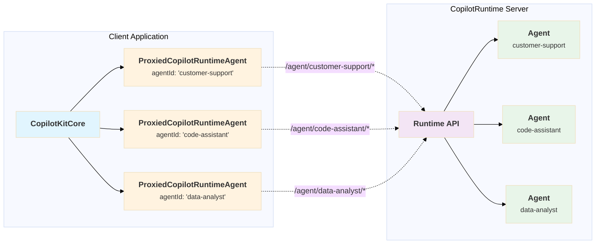

`ProxiedCopilotRuntimeAgent` is a specialized HTTP agent that acts as a proxy between your client application and remote agents hosted on the `CopilotRuntime` server. It extends the base `HttpAgent` class to provide seamless communication with runtime-hosted agents.

## Architecture Overview

<div className="mermaid">

</div>

## What is ProxiedCopilotRuntimeAgent?

When `CopilotKitCore` connects to a `CopilotRuntime` server, it discovers available remote agents. For each remote agent, it creates a `ProxiedCopilotRuntimeAgent` instance that handles all communication with that specific agent through the runtime's API endpoints.

Key characteristics:

- **Automatic URL Construction**: Builds the correct runtime API URLs for agent operations
- **Connection Management**: Provides both `run` and `connect` methods for different interaction patterns
- **Event Streaming**: Transforms HTTP event streams into Observable events for real-time updates
- **Header Forwarding**: Inherits and forwards authentication headers from `CopilotKitCore`

## How It Works

The proxy pattern enables several important capabilities:

1. **Runtime Integration**: Remote agents are accessed through standardized runtime endpoints rather than direct connections
2. **Security**: Authentication and authorization are handled at the runtime level
3. **Scalability**: The runtime can manage agent lifecycle, load balancing, and resource allocation
4. **Abstraction**: Client code doesn't need to know the actual location or implementation of remote agents

## Creating a ProxiedCopilotRuntimeAgent

<Note>
  In typical usage, you don't create `ProxiedCopilotRuntimeAgent` instances directly. `CopilotKitCore` automatically creates them when discovering agents from the runtime.
</Note>

```typescript
import { ProxiedCopilotRuntimeAgent } from "@copilotkitnext/core";

const agent = new ProxiedCopilotRuntimeAgent({
  runtimeUrl: "https://your-runtime.example.com",
  agentId: "my-agent",
  headers: {
    "Authorization": "Bearer your-token"
  }
});
```

## Configuration

### ProxiedCopilotRuntimeAgentConfig

The configuration extends `HttpAgentConfig` but omits the `url` field since URLs are constructed automatically:

```typescript
interface ProxiedCopilotRuntimeAgentConfig extends Omit<HttpAgentConfig, "url"> {
  runtimeUrl?: string;       // Base URL of your `CopilotRuntime` server
  agentId: string;           // Unique identifier of the remote agent
  headers?: Record<string, string>;  // HTTP headers for authentication
}
```

Configuration properties:

- `runtimeUrl`: The base URL where your `CopilotRuntime` is hosted (e.g., "https://api.example.com/copilot")
- `agentId`: The identifier of the specific agent on the runtime
- `headers`: Optional HTTP headers, typically used for authentication tokens

## Methods

### run()

Executes the agent with the provided input and returns an Observable stream of events. This method is inherited from the `HttpAgent` base class.

```typescript
run(input: RunAgentInput): Observable<BaseEvent>
```

The `run` method:
- Makes a POST request to `/agent/{agentId}/run` on the runtime
- Streams events as the agent processes the request
- Supports messages, tools, and properties as input

#### Parameters

```typescript
interface RunAgentInput {
  messages?: Message[];              // Conversation history
  tools?: Tool[];                   // Available tools for the agent
  forwardedProps?: Record<string, unknown>;  // Additional context
}
```

### connect()

Establishes a connection to an existing agent session, useful for resuming conversations or monitoring ongoing operations.

```typescript
connect(input: RunAgentInput): Observable<BaseEvent>
```

The `connect` method:
- Makes a POST request to `/agent/{agentId}/connect` on the runtime
- Returns existing conversation state and subscribes to new events
- Does not trigger a new agent run

## URL Construction

ProxiedCopilotRuntimeAgent automatically constructs the appropriate URLs for agent operations:

- **Run endpoint**: `{runtimeUrl}/agent/{agentId}/run`
- **Connect endpoint**: `{runtimeUrl}/agent/{agentId}/connect`

This ensures consistency and eliminates the need for manual URL management in your application code.

## Event Handling

Both `run()` and `connect()` return RxJS Observables that emit various event types:

```typescript
agent.run({ messages: [...] }).subscribe({
  next: (event) => {
    switch (event.type) {
      case "text":
        console.log("Agent says:", event.text);
        break;
      case "tool-call":
        console.log("Agent requests tool:", event.toolName);
        break;
      case "error":
        console.error("Agent error:", event.error);
        break;
    }
  },
  error: (err) => console.error("Stream error:", err),
  complete: () => console.log("Agent finished")
});
```

## Integration with CopilotKitCore

`CopilotKitCore` automatically creates `ProxiedCopilotRuntimeAgent` instances during runtime discovery:

1. `CopilotKitCore` fetches `/info` from the runtime
2. The runtime responds with available agents
3. For each agent, `CopilotKitCore` creates a `ProxiedCopilotRuntimeAgent`
4. These agents are merged with any local agents
5. The agents become available through `copilotKit.getAgent()`

## Security Considerations

ProxiedCopilotRuntimeAgent inherits security features from the runtime:

- **Authentication**: Headers (including auth tokens) are forwarded with each request
- **Isolation**: Each agent runs in the runtime's controlled environment
- **Validation**: The runtime validates requests before forwarding to agents
- **Rate Limiting**: The runtime can enforce rate limits and quotas

## Error Handling

The agent handles various error scenarios:

- **Network Errors**: Connection failures, timeouts
- **Runtime Errors**: Authentication failures, agent not found
- **Agent Errors**: Processing failures, validation errors

```typescript
agent.run({ messages: [...] }).subscribe({
  next: (event) => {
    if (event.type === "error") {
      console.error("Agent error:", event.error);
      // Handle gracefully
    }
  },
  error: (err) => {
    console.error("Connection error:", err);
    // Retry or fallback
  }
});
```

## Best Practices

1. **Let CopilotKitCore manage agents**: Don't create `ProxiedCopilotRuntimeAgent` instances manually unless necessary
2. **Handle connection errors**: Implement retry logic for transient network issues
3. **Monitor event streams**: Subscribe to events to track agent progress and handle errors
4. **Use appropriate endpoints**: Use `run()` for new operations, `connect()` for existing sessions
5. **Secure your runtime**: Ensure proper authentication and HTTPS for production deployments

## Example: Using with `CopilotKitCore`

```typescript
// `CopilotKitCore` automatically creates proxied agents
const copilotKit = new CopilotKitCore({
  runtimeUrl: "https://api.example.com/copilot",
  headers: {
    "Authorization": "Bearer your-token"
  }
});

// Wait for runtime connection
await new Promise(resolve => {
  copilotKit.subscribe({
    onRuntimeConnectionStatusChanged: ({ status }) => {
      if (status === "Connected") resolve(undefined);
    }
  });
});

// Get a proxied agent
const agent = copilotKit.getAgent("customer-support");
if (agent instanceof ProxiedCopilotRuntimeAgent) {
  // This agent is hosted on the runtime
  const result = await copilotKit.runAgent({
    agent,
    withMessages: [{ role: "user", content: "Hello" }]
  });
}
```

## TypeScript Types

```typescript
import { HttpAgent, HttpAgentConfig, RunAgentInput, BaseEvent } from "@ag-ui/client";
import { Observable } from "rxjs";

export interface ProxiedCopilotRuntimeAgentConfig
  extends Omit<HttpAgentConfig, "url"> {
  runtimeUrl?: string;
}

export class ProxiedCopilotRuntimeAgent extends HttpAgent {
  runtimeUrl?: string;

  constructor(config: ProxiedCopilotRuntimeAgentConfig);
  connect(input: RunAgentInput): Observable<BaseEvent>;
}
```